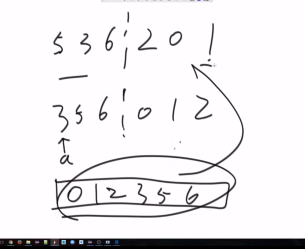

# 算法

## 1.时间复杂度

有序数组A （N个）,无序数组B（M个），打印B中没有A的的数字

method1：两遍遍历O（M*N)

method2 :

对于B中每一个数在A中进行二分查找

> 二分：每次砍一半，一共可以砍logN次

时间复杂度：O(M*logN) 

method3: 

先把B排序，用外排的形式找


1）第一步B数组排序

O（M*logM)

2)外排 最多 A划过N个数，B划过M个数 O（M+N)

InTotal :    O(M*logM) + O(M+N)算法   （根据实际M和N大小判断时间复杂度） 


对数器概念和使用

对数器的概念和使用 

0，有一个你想要测的方法a， 

1，实现一个绝对正确但是复杂度不好的方法b， 

2，实现一个随机样本产生器 

3，实现比对的方法 

4，把方法a和方法b比对很多次来验证方法a是否正确。 

5，如果有一个样本使得比对出错，打印样本分析是哪个方法出 错 

6，当样本数量很多时比对测试依然正确，可以确定方法a已经 正确。


冒泡排序：

1.先看0,1位置，再看1,2位置 如果大交换

0跟1, 1跟2,   2跟3，干完一圈最大的数到最后了

继续排0到N-1 再从0到N-2

N-1 + N-2 + N-3 + ... +2+1 等差数列 O(N平方）


选择排序 O(N平方)

0到 n-1选一个最小的放在0位置， 1到n-1 选一个最小的放在1位置


插入排序（很有用）：扑克牌整牌类似， 新抓一张往里插

往排好的里面插，从排好数字最后开始比一直比到排好数字的第一个


选择和冒泡和数据状况没关系

插入排序（最差 O（n）平方   最好O(n)    ）

怎么评价算法好坏：  都是按照最差情况

## 2.递归

在一个数组中找最大值

递归函数就是系统帮你压栈

系统记录第十行

```java
maxLeft = getMax（arr，L，mid）;
```


压栈不断向上，串接子过程和父过程的通信

任何递归行为都可以变为迭代行为

递归行为分析复杂度：
$$
T(N) = aT(N/b) +O(N^d)
$$


递归排序：先左侧后右侧，接着用外排的形式排好


$$
T(n) = 2T(n/2) + O(n)
$$

## 3.快排

问题一：给定一个数组arr，和一个数num，请把小于等于num的数放在数 组的左边，大于num的数放在数组的右边。

 要求额外空间复杂度O(1)，时间复杂度O(N) 

问题二（荷兰国旗问题） 给定一个数组arr，和一个数num，请把小于num的数放在数组的 左边，等于num的数放在数组的中间，大于num的数放在数组的 右边。

 要求额外空间复杂度O(1)，时间复杂度O(N)


小于等于区域扩一个位置，大于的区域往下不用动

荷兰国旗：

三个指针小于，大于，等于

current和more撞上了停止


经典快排问题可能会打偏只有小于最后一个数的区域

只有一边，就蜕变成了O(n)平方

最好区域每次都是正中间
$$
T(N) = 2T(N/2) + O(N)
$$
所以和数据状况有关！！！

引入 ：    随机快排 排之前随机选一个数与最后一个数交换

复杂度就是概率表达式

长期期望复杂度O（N*LogN)
